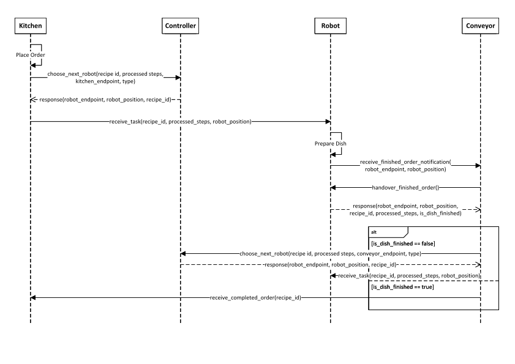
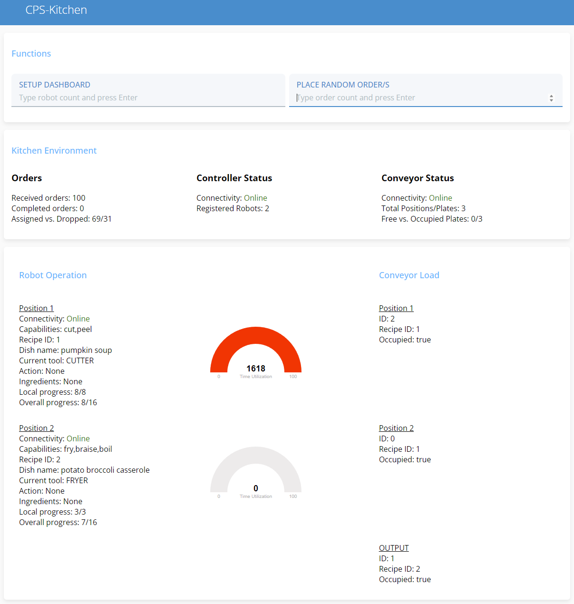

# OPC UA CPS-Kitchen

## Intro
Cyberphysical systems in dynamic environments require adaptability to react appropriately.
The OPC UA standard facilitates service accessibility and monitoring of cyberphysical devices of the industrial domain. This implementation integrates a cyberphysical kitchen into a OPC UA structure.

## Kitchen Environment
The kitchen environment consists of several robots positioned along a circular conveyor belt that moves in one direction.
The cyberphysical kitchen employs a multiagent system to process placed orders.
In total, there are four agents: Kitchen, Robot, Conveyor and Controller.
- The Kitchen-Agent assigns placed orders to Robot-Agents and monitors the connectivity of all other agents - the Robot, Conveyor and Controller.
- Robot-Agents prepare the dishes assigned to them according to the FIFO principle. Each of them uses a certain set of tools to accomplish partial steps of an order. In other words, their capabilities differ from each other which requires them to cooperate to complete dishes.
- The Conveyor-Agent retrieves completed and partially finished dishes from the Robot-Agents and coordinates the assignment of partially finished dishes or delivers completed dishes to the Kitchen-Agent.
- The Controller-Agent monitors the operation status of Robot-Agents to choose a suitable robot for the next steps of a dish, when the Kitchen- or Conveyor-Agent asks for it.

## Kitchen Workflow
The sequence diagram below shows the workflow of the kitchen.
First, the Kitchen-Agent asks the Controller-Agent for a suitable Robot-Agent to prepare a dish according to the placed order.
After the Controller-Agent responds with a suitable Robot-Agent, the Kitchen-Agent assigns the Robot-Agent to process the order.
The Robot-Agent prepares the dish to the best of its capabilities and notifies the Conveyor-Agent about it whereupon the Conveyor-Agent retrieves it.
The Conveyor-Agent checks then if the dish is done completely or partially.
If partially, the Conveyor-Agent asks the Controller-Agent for a suitable Robot-Agent for the next preparation steps and delivers it there.
Otherwise the Conveyor-Agent delivers a completed dish to the Kitchen-Agent.



## Robot Capabilities and Tools
Each Robot-Agent has a certain set of capabilities to perform preparation steps of incoming orders.
They are defined in a JSON array like below and are tied to corresponding tools.
Robot-Agents must therefore retool if the currently equipped tool cannot perform a required preparation step.
```json
{
    "capabilities" : ["boil","braise","fry"]
}
```

## Recipes
The kitchen describes orders via recipes.
Recipes are described in JSON format like below.
A recipe is identified by an ID and consists of the attributes *name*, which specifies the name of the dish, and an *instructions* array, which contains the preparation steps arranged in sequential order.
Each step is described by an *action* that specifies the preparation step, the *ingredients* that specify the required ingredients, and a *duration* that specifies the time the *action* takes to finish.
An *action* without a *duration* takes the time a Robot-Agent needs to perform it.

```json
"1" : {
    "name" : "pumpkin soup",
    "instructions" : [
        {
            "action" : "...",
            "ingredients" : "..."
        },
        {
            "action" : "cut",
            "ingredients" : "onion"
        },
        {
            "action" : "braise",
            "ingredients" : "pumpkin, carrot, ginger, onion"
        },
        {
            "action" : "boil",
            "ingredients" : "pumpkin, carrot, ginger",
            "duration" : 10
        },
        {
            "action" : "...",
            "ingredients" : "..."
        },
    ]
}
```

## Dashboard
The dashboard shows the processing status of orders and operation status of all agents.
It is divided into three areas:
- The top provides the two input fields *SETUP DASHBOARD* and *PLACE RANDOM ORDER/S*.
The former field expects the count of Robot-Agents to setup the dashboard accordingly.
The latter expects to put in any positive number to place random orders.
- The middle shows the processing status of orders, the Controller-Agent's connectivity and how many Robot-Agents registered with it, and the Conveyor-Agent's connectivity with its total capacity as well as how many plates are currently free or occupied.
- The bottom shows the operation and utilization of the Robot-Agents and the Conveyor-Agent in detail.



## Dependencies
TODO
- OS: Linux

## Starting the Environment and Dashboard
The kitchen environment is started with the [startup_kitchen.bash](start_scripts/startup_kitchen.bash) script and expects the robot count as a parameter.
For example, when you are in the project root directory:
```bash
start_scripts/startup_kitchen.bash 4
```
The dashboard is started with the [start_dashboard.bash](start_scripts/start_dashboard.bash) script and expects the robot count as a parameter as well.
For example, when you are in the project root directory:
```bash
start_scripts/start_dashboard.bash 4
```
*Note: The backend and frontend for the dashboard use the ports 8080 and 8000. Either make sure they are not already in use or change them in [backend.js](cps-kitchen-dashboard/backend.js), [frontend.js](cps-kitchen-dashboard/frontend.js) and [start_dashboard.bash](start_scripts/start_dashboard.bash)*

Open the dashboard in an Internet browser with the address *localhost:8000*.
In the input field *SETUP DASHBOARD* type the robot count you used in the steps before and press enter.
Then type any positive number in the input field *PLACE RANDOM ORDER/S* and press enter.
The Robot-Agents and Conveyor-Agent should now prepare and transport orders.

## Define and Set Capabilities
Capability profiles are set in separate JSON files in the capabilites folder.
Valid actions with their duration are defined in the [robot_actions.cpp](actions/src/robot_actions.cpp) file.
Further actions with durations can be defined there and must be add in the *action_map_* in the constructor.
There are the two types *autonomous_action* and *recipe_timed_action*.
The latter has no duration but must be defined in the recipe.
Further tools can be defined in [robot_tool.hpp](robot/include/robot_tool.hpp) in the *robot_tool* enum class and need a string representation in the *robot_tool_to_string* method to be displayed correctly in the dashboard.
A capability profile for a Robot-Agent at a certain position can be set in the *position_capabilities* map in [start_robots.bash](start_scripts/start_robots.bash).

## Define Recipes
Recipes are defined in the [recipes.json](recipes.json) file in the root folder.
Recipe IDs must be consecutive starting at 1 with no gaps (e.g. 1,2,3,4,5 is valid; 1,2,4,5 is invalid because 3 is missing).
Only recipe timed actions must define a duration; other actions do not (see also [Define and Set Capabilities](#define-and-set-capabilities)).

## Setting Time Units
TODO

## Implement Your Own Scheduling Algorithm
TODO

## Open Tasks
Currently there are no mechanisms implemented to take impact on the environment like rearranging or reconfiguring Robot-Agents.
The following list shows upcoming features:
- [ ] Rearranging Robot-Agents
- [ ] Reconfiguring Robot-Agents
- [ ] MAPE-K interface